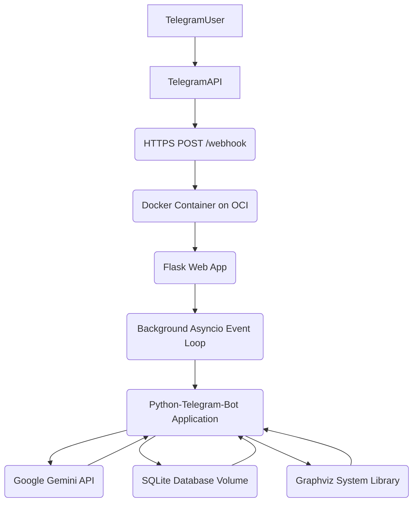

# Product Architecture: Journal Agent Telegram Bot

This document provides a comprehensive overview of the Journal Agent Telegram Bot's architecture, technology stack, design principles, and operational considerations. It serves as a central reference for understanding the system and guiding future development, maintenance, and scaling efforts.

---

## 1. Overview & Purpose

The Journal Agent is a multi-modal Telegram bot designed to facilitate personal journaling and self-reflection. It leverages advanced Artificial Intelligence (AI), specifically Google's Gemini models, for in-depth analysis of user entries (text, audio transcriptions, and image OCR). The bot's core mission is to provide users with actionable insights into their thoughts, emotions, and behavioral patterns, thereby promoting self-awareness, personal growth, and overall well-being. It aims to move beyond simple data logging to actively support a user's journey of self-discovery.

---

## 2. Core Functionality

*   **Multi-modal Input:** Users can interact with the bot using various input types:
    *   **Text Messages:** Standard text-based conversations and journal entries.
    *   **Voice Messages:** Audio is transcribed into text using AI for processing.
    *   **Images:** Text is extracted from images using Optical Character Recognition (OCR) via AI.
*   **Mode Selection:** Users can dynamically switch between different operational modes:
    *   **Chatbot Mode:** For general conversational interactions with the AI.
    *   **Journaling Mode:** Dedicated for recording personal thoughts, experiences, and reflections, which are then analyzed by AI.
    *   **OCR Mode:** Specifically for extracting and displaying text content from images.
*   **Journaling & AI Analysis:**
    *   Records journal entries with associated metadata (timestamp, input type, word count).
    *   Performs AI-driven analysis to extract sentiment, topics, and categories.
    *   Generates visual reports via the `/analytics` command (Sentiment distribution, Topic trends).
    *   Generates reflective "therapist-like" analysis and visual mind maps.
*   **Goal Tracking:**
    *   Allows users to set personal goals via `/setgoal`.
    *   Tracks progress updates in the database.
    *   Users can view multiple active goals via `/mygoals`.
*   **User Management:** Stores user profiles and approval status.
*   **Token Usage Tracking:** Monitors AI token consumption (prompt, completion, total) per interaction.
*   **Command Handling:** Responds to commands including `/start`, `/help`, `/setusername`, `/tokens`, `/search`, `/export`, `/analytics`, `/setgoal`, `/mygoals`.
*   **Journal Export:** Allows users to export entries as a text file.

---

## 3. Technology Stack

### 3.1. Programming Language

*   **Python 3.11+**: The primary development language.
    *   **Justification**: Python was chosen for its extensive libraries, strong community support, and suitability for AI/ML and bot development. Its readability and large community support contribute to faster development cycles and easier maintenance. The `asyncio` framework built into Python is fundamental for handling concurrent operations.

### 3.2. Core Frameworks & Libraries

*   **Python-Telegram-Bot (PTB)**: A high-level, asynchronous wrapper for the Telegram Bot API.
    *   **Role**: Handles all interactions with the Telegram platform, including receiving updates, sending messages, managing inline keyboards, and orchestrating conversational flows via `ConversationHandler`. Its asynchronous nature (`async/await`) is critical for responsive bot operation.
*   **Flask**: A lightweight Python web framework.
    *   **Role**: Used to create the webhook endpoint (`/webhook`) that receives updates from Telegram. It acts as the bridge between the synchronous WSGI server (like Gunicorn on PythonAnywhere) and the asynchronous `python-telegram-bot` application, running the PTB event loop in a separate thread.
*   **Google Generative AI (`google-generativeai`)**: Python SDK for interacting with Google's Gemini models.
    *   **Role**: The core AI engine. It's used for all generative tasks: text completion (chatbot), advanced text analysis (sentiment, topics, summaries, reflections), audio transcription, and Optical Character Recognition (OCR) from images.
*   **`python-dotenv`**: A library for loading environment variables from a `.env` file.
    *   **Role**: Ensures sensitive information (API keys, webhook URLs) is kept out of the codebase and managed securely in the deployment environment.
*   **`sqlite3` (Built-in Python)**: Python's standard library interface for SQLite, a C-language library that implements a small, fast, self-contained, high-reliability, full-featured, SQL database engine.
    *   **Role**: Provides persistent, file-based storage for all application data. Chosen for its zero-configuration nature, transactional safety, and suitability for single-user or low-concurrency applications, making it ideal for PythonAnywhere's free tier.
*   **Pillow (`PIL.Image`)**: The Python Imaging Library.
    *   **Role**: Used for basic image manipulation, specifically opening image files received from Telegram before they are passed to the Gemini Vision API for OCR.
*   **`graphviz` (Python library)**: A Python interface for Graphviz, an open-source graph visualization software.
    *   **Role**: Generates visual mind maps from DOT language strings (produced by the Gemini AI). It requires a system-level Graphviz executable to be installed on the hosting environment.
*   **`asyncio`**: Python's built-in library for writing concurrent code.
    *   **Role**: Fundamental for handling multiple I/O-bound operations (network requests to Telegram, Gemini, file I/O) efficiently without blocking the main execution thread. It enables the bot to remain responsive.
*   **`threading`**: Python's built-in module for running code in separate threads.
    *   **Role**: Used in `app.py` to run the `asyncio` event loop in a dedicated background thread. This allows the synchronous Flask web server to safely interact with the asynchronous `python-telegram-bot` application without blocking the web server's main thread.
*   **`uuid`**: Python's built-in module for generating Universally Unique Identifiers.
    *   **Role**: Used to generate unique IDs for entries, goals, and progress records.
*   **`Docker` & `Docker Compose`**:
    *   **Role**: Containerization for consistent deployment across local development and OCI production environments.
*   **`pytest` & `pytest-asyncio`**:
    *   **Role**: Automated unit and integration testing of database logic and bot handlers.

### 3.3. AI Models

*   **Google Gemini (`gemini-2.5-flash`)**: The primary generative AI model.
    *   **Role**: Utilized for all AI-powered features: text analysis, summaries, audio transcription, and OCR.
    *   **Justification**: Updated to `2.5-flash` for significantly faster response times and improved reasoning while staying within the Free Tier limits. Includes local `RateLimiter` to manage 15 RPM / 1500 RPD.

### 3.4. Data Storage

All persistent application data is stored in a single SQLite database file (`bot_data/bot_data.db`). The schema is designed for extensibility and to support future self-reflection features.

#### **Database Schema Details**

**1. `Users` Table**
*   **Purpose**: Stores core user information and preferences.
*   **SQL `CREATE TABLE` Statement**:
    ```sql
    CREATE TABLE IF NOT EXISTS Users (
        user_id INTEGER PRIMARY KEY,
        telegram_id INTEGER UNIQUE NOT NULL,
        username TEXT,
        created_at TIMESTAMP DEFAULT CURRENT_TIMESTAMP,
        last_active_at TIMESTAMP,
        timezone TEXT,
        preferred_language TEXT,
        is_approved INTEGER DEFAULT 0, -- 0 for False, 1 for True
        settings TEXT -- Stored as JSON string
    )
    ```
*   **Column Details**:
    *   `user_id` (INTEGER, PRIMARY KEY): Internal unique identifier for the user.
        *   *Justification*: Fundamental for linking all user-specific data across tables.
    *   `telegram_id` (INTEGER, UNIQUE, NOT NULL): Telegram's unique user ID.
        *   *Justification*: Essential for bot interaction and linking to the external Telegram platform. `UNIQUE` ensures one entry per Telegram user.
    *   `username` (TEXT): User's chosen display name within the bot.
        *   *Justification*: Personalization and display in bot responses.
    *   `created_at` (TIMESTAMP, DEFAULT CURRENT_TIMESTAMP): Timestamp when the user account was first created in the bot's database.
        *   *Justification*: Enables cohort analysis, understanding user onboarding trends, and calculating user tenure.
    *   `last_active_at` (TIMESTAMP): Timestamp of the user's last interaction with the bot.
        *   *Justification*: Tracks user engagement, helps identify dormant users for re-engagement strategies, and provides insights into usage patterns.
    *   `timezone` (TEXT, NULLABLE): User's local timezone (e.g., 'America/New_York').
        *   *Justification*: Ensures accurate time-based analysis of entries and activities, crucial for daily summaries, scheduling reminders, and time-sensitive insights.
    *   `preferred_language` (TEXT, NULLABLE): User's preferred language (e.g., 'en', 'es').
        *   *Justification*: Enables localization of bot responses, AI prompt generation, and future content delivery.
    *   `is_approved` (INTEGER, DEFAULT 0): Flag indicating if the user has been administratively approved (0 for False, 1 for True).
        *   *Justification*: Essential for access control, especially for beta features or restricted bot usage.
    *   `settings` (TEXT, NULLABLE): Stores user-specific, flexible settings as a JSON string (e.g., notification preferences, default journal mode, AI verbosity level).
        *   *Justification*: Allows for highly customizable user experience without frequent schema migrations; future-proofs for new settings.

**2. `JournalEntries` Table**
*   **Purpose**: Stores the raw journal content and basic metadata about each entry.
*   **SQL `CREATE TABLE` Statement**:
    ```sql
    CREATE TABLE IF NOT EXISTS JournalEntries (
        entry_id TEXT PRIMARY KEY,
        user_id INTEGER NOT NULL,
        raw_content TEXT NOT NULL,
        input_type TEXT NOT NULL,
        created_at TIMESTAMP DEFAULT CURRENT_TIMESTAMP,
        modified_at TIMESTAMP DEFAULT CURRENT_TIMESTAMP,
        entry_date TEXT, -- YYYY-MM-DD format for easier date queries
        entry_time TEXT, -- HH:MM:SS format for easier time queries
        word_count INTEGER,
        is_private INTEGER DEFAULT 1, -- 0 for False, 1 for True
        location_data TEXT, -- Stored as JSON string (e.g., {"city": "London", "lat": 51.5, "lon": 0.1})
        device_info TEXT, -- e.g., "Android", "iOS", "Telegram Desktop"
        ai_model_version TEXT -- Version of the AI model used for initial analysis
    )
    ```
*   **Column Details**:
    *   `entry_id` (TEXT, PRIMARY KEY): Unique identifier for each journal entry (e.g., UUID).
        *   *Justification*: Unique identification for all related data (insights, moods, activities).
    *   `user_id` (INTEGER, NOT NULL): Links entry to the `Users` table.
        *   *Justification*: Fundamental for personalizing the journaling experience and retrieving user-specific data.
    *   `raw_content` (TEXT, NOT NULL): The original, unedited text, audio transcription, or OCR text of the entry.
        *   *Justification*: The core data of the journal; allows for re-analysis with newer AI models.
    *   `input_type` (TEXT, NOT NULL): Type of input used to create the entry (e.g., 'text', 'audio', 'image').
        *   *Justification*: Helps understand user preferences and optimize input methods; enables analysis of how input type correlates with content/mood.
    *   `created_at` (TIMESTAMP, DEFAULT CURRENT_TIMESTAMP): Exact timestamp of entry creation.
        *   *Justification*: Enables precise temporal analysis (e.g., journaling frequency, time-of-day patterns).
    *   `modified_at` (TIMESTAMP, DEFAULT CURRENT_TIMESTAMP): Last time the entry was modified.
        *   *Justification*: Tracks user engagement with past entries, indicates active reflection or editing habits.
    *   `entry_date` (TEXT): Date of the entry in 'YYYY-MM-DD' format.
        *   *Justification*: Simplifies daily summaries, weekly/monthly trend analysis without complex timestamp parsing.
    *   `entry_time` (TEXT): Time of the entry in 'HH:MM:SS' format.
        *   *Justification*: Identifies peak journaling times, correlates with daily routines or events.
    *   `word_count` (INTEGER): Number of words in the `raw_content`.
        *   *Justification*: Tracks verbosity, identifies detailed vs. brief entries, and can correlate with emotional states or topics.
    *   `is_private` (INTEGER, DEFAULT 1): Flag if entry should be private (0 for False, 1 for True).
        *   *Justification*: Provides user control over data privacy, essential for trust.
    *   `location_data` (TEXT, NULLABLE): Optional, privacy-consenting location data as a JSON string (e.g., `{"city": "London", "lat": 51.5, "lon": 0.1}`).
        *   *Justification*: **Future-Proofing**: Enables "Geospatial Mood Mapping" or "Location-based Triggers" (e.g., "You tend to feel more anxious when journaling from the office"). This seemingly minor piece of data, if consistently collected, could unlock powerful insights into environmental influences on well-being.
    *   `device_info` (TEXT, NULLABLE): Information about the device used (e.g., 'Android', 'iOS', 'Telegram Desktop', 'Web').
        *   *Justification*: Understanding platform-specific usage patterns, debugging, and optimizing UI/UX.
    *   `ai_model_version` (TEXT, NULLABLE): Version of the AI model used for initial analysis of this entry.
        *   *Justification*: **Future-Proofing**: Crucial for "Retrospective AI Re-analysis." As AI models improve, the app could offer to re-analyze old entries with newer, more sophisticated models, uncovering new insights.

**3. `AIInsights` Table**
*   **Purpose**: Stores AI-generated analysis and insights for each journal entry.
*   **SQL `CREATE TABLE` Statement**:
    ```sql
    CREATE TABLE IF NOT EXISTS AIInsights (
        insight_id TEXT PRIMARY KEY,
        entry_id TEXT NOT NULL, -- FOREIGN KEY to JournalEntries.entry_id
        sentiment_score REAL, -- e.g., -1.0 to 1.0
        sentiment_label TEXT, -- e.g., 'Positive', 'Negative', 'Neutral', 'Mixed', 'Ambivalent'
        detected_emotions TEXT, -- Stored as JSON string (e.g., [{"emotion": "joy", "score": 0.8}, {"emotion": "sadness", "score": 0.2}])
        key_topics TEXT, -- Stored as JSON string (e.g., ["work stress", "family dynamics", "personal growth"])
        named_entities TEXT, -- Stored as JSON string (e.g., [{"name": "John", "type": "PERSON"}, {"name": "London", "type": "LOCATION"}])
        summary TEXT, -- A concise AI-generated summary of the entry
        reflection_questions TEXT, -- Stored as JSON string (AI-generated questions for user reflection)
        cognitive_distortions TEXT, -- Stored as JSON string (e.g., ["catastrophizing", "all-or-nothing thinking"])
        ai_feedback_rating INTEGER, -- User's rating of the AI's helpfulness for this insight (e.g., 1-5)
        generated_at TIMESTAMP DEFAULT CURRENT_TIMESTAMP
    )
    ```
*   **Column Details**:
    *   `insight_id` (TEXT, PRIMARY KEY): Unique ID for the insight record.
    *   `entry_id` (TEXT, NOT NULL): Links insight to its source entry (`JournalEntries.entry_id`).
        *   *Justification*: Direct association with the raw content it analyzes.
    *   `sentiment_score` (REAL, NULLABLE): Numerical sentiment score (e.g., -1.0 to 1.0).
        *   *Justification*: Enables quantitative sentiment trend analysis over time, allowing for more granular tracking than just labels.
    *   `sentiment_label` (TEXT, NULLABLE): Categorical sentiment (e.g., 'Positive', 'Negative', 'Neutral', 'Mixed', 'Ambivalent').
        *   *Justification*: Provides an easily digestible summary of the overall feeling.
    *   `detected_emotions` (TEXT, NULLABLE): Array of detected emotions and their confidence scores as a JSON string.
        *   *Justification*: Enables nuanced emotional tracking beyond simple sentiment, identifying co-occurring emotions and their intensity.
    *   `key_topics` (TEXT, NULLABLE): Array of identified key topics/themes as a JSON string.
        *   *Justification*: Enables topic trend analysis, identifying recurring themes in a user's life over time.
    *   `named_entities` (TEXT, NULLABLE): Array of detected named entities (people, organizations, locations mentioned) as a JSON string.
        *   *Justification*: Enables "Relationship Tracking" (e.g., sentiment towards specific people over time) and deeper context understanding.
    *   `summary` (TEXT, NULLABLE): A concise AI-generated summary of the entry.
        *   *Justification*: Provides quick overview, useful for search snippets or daily digests.
    *   `reflection_questions` (TEXT, NULLABLE): AI-generated questions for the user to ponder based on the entry's content as a JSON string.
        *   *Justification*: Directly fuels guided self-reflection and future prompt generation.
    *   `cognitive_distortions` (TEXT, NULLABLE): Array of detected cognitive distortions (e.g., 'catastrophizing', 'all-or-nothing thinking') as a JSON string.
        *   *Justification*: **Future-Proofing**: Enables a "Personalized CBT Coach." Over time, the app could identify a user's most common distortions and proactively suggest targeted mental exercises or resources.
    *   `ai_feedback_rating` (INTEGER, NULLABLE): User's rating of the AI's helpfulness for this insight (e.g., 1-5).
        *   *Justification*: **Future-Proofing**: Crucial for "Adaptive AI Personalization & Cost Optimization." By tracking user satisfaction, the system can learn to provide more relevant insights and optimize AI resource allocation.
    *   `generated_at` (TIMESTAMP, DEFAULT CURRENT_TIMESTAMP): When the insight was generated.
        *   *Justification*: Tracks re-analysis, helps understand AI processing time and latency.

**4. `Prompts` Table**
*   **Purpose**: Stores predefined and user-created journaling prompts.
*   **SQL `CREATE TABLE` Statement**:
    ```sql
    CREATE TABLE IF NOT EXISTS Prompts (
        prompt_id TEXT PRIMARY KEY,
        prompt_text TEXT NOT NULL,
        category TEXT, -- e.g., 'AI_Utility', 'AI_Analysis', 'Gratitude', 'Morning_Reflection'
        is_guided INTEGER DEFAULT 0, -- 0 for False, 1 for True (part of a structured program)
        created_by_user_id INTEGER, -- NULL for system prompts, user_id for custom prompts
        created_at TIMESTAMP DEFAULT CURRENT_TIMESTAMP
    )
    ```
*   **Column Details**:
    *   `prompt_id` (TEXT, PRIMARY KEY): Unique ID for the prompt.
    *   `prompt_text` (TEXT, NOT NULL): The actual text of the prompt.
    *   `category` (TEXT, NULLABLE): Category of the prompt (e.g., 'Gratitude', 'Reflection', 'CBT', 'Morning', 'Evening', 'AI_Utility', 'AI_Analysis').
        *   *Justification*: Allows for filtering and recommending prompts.
    *   `is_guided` (INTEGER, DEFAULT 0): True if part of a structured program (0 for False, 1 for True).
        *   *Justification*: Differentiates standalone prompts from program-specific ones.
    *   `created_by_user_id` (INTEGER, NULLABLE): Null for system prompts, user ID for custom prompts.
        *   *Justification*: Enables users to create and manage their own prompts.
    *   `created_at` (TIMESTAMP, DEFAULT CURRENT_TIMESTAMP): When the prompt was created.
        *   *Justification*: Tracks prompt evolution and popularity.

**5. `TokenUsage` Table**
*   **Purpose**: Tracks AI token consumption for billing, usage analysis, and cost optimization.
*   **SQL `CREATE TABLE` Statement**:
    ```sql
    CREATE TABLE IF NOT EXISTS TokenUsage (
        usage_id TEXT PRIMARY KEY,
        user_id INTEGER NOT NULL,
        date TEXT NOT NULL, -- YYYY-MM-DD format for daily aggregation
        prompt_tokens INTEGER NOT NULL,
        completion_tokens INTEGER NOT NULL,
        total_tokens INTEGER NOT NULL,
        daily_tokens INTEGER NOT NULL, -- Added for daily aggregation
        feature_used TEXT, -- e.g., 'chatbot', 'journal_analysis', 'ocr', 'punctuation'
        model_name TEXT, -- e.g., 'gemini-1.5-flash-latest', 'gemini-pro-vision'
        logged_at TIMESTAMP DEFAULT CURRENT_TIMESTAMP
    )
    ```
*   **Column Details**:
    *   `usage_id` (TEXT, PRIMARY KEY): Unique ID for each usage record (e.g., UUID).
    *   `user_id` (INTEGER, NOT NULL): Links to the `Users` table.
    *   `date` (TEXT, NOT NULL): Date of usage in 'YYYY-MM-DD' format.
        *   *Justification*: For daily aggregation of token usage.
    *   `prompt_tokens` (INTEGER, NOT NULL): Tokens sent to the AI model as input.
        *   *Justification*: Tracks input cost.
    *   `completion_tokens` (INTEGER, NOT NULL): Tokens received from the AI model as output.
        *   *Justification*: Tracks output cost.
    *   `total_tokens` (INTEGER, NOT NULL): Sum of `prompt_tokens` and `completion_tokens`.
        *   *Justification*: Overall cost tracking.
    *   `daily_tokens` (INTEGER, NOT NULL): Total tokens used on a specific date.
        *   *Justification*: Enables quick retrieval of daily token consumption without summing individual records.
    *   `feature_used` (TEXT, NULLABLE): Which bot feature triggered the AI call (e.g., 'chatbot', 'journal_analysis', 'ocr', 'punctuation', 'audio_transcription', 'mind_map_gen').
        *   *Justification*: **Future-Proofing**: Enables "Cost Allocation per Feature" and understanding the value proposition of different AI features. This data, combined with `AIInsights.ai_feedback_rating`, is crucial for both product improvement and business sustainability.
    *   `model_name` (TEXT, NULLABLE): The specific AI model used (e.g., 'gemini-1.5-flash-latest', 'gemini-pro-vision').
        *   *Justification*: Tracks model performance, cost, and allows for A/B testing of different models.
    *   `logged_at` (TIMESTAMP, DEFAULT CURRENT_TIMESTAMP): Exact timestamp of the usage record.
        *   *Justification*: Precise tracking for debugging and real-time monitoring.

**6. `UserMoods` Table**
*   **Purpose**: Stores explicit user-logged mood states (inspired by Daylio/Reflectly).
*   **SQL `CREATE TABLE` Statement**:
    ```sql
    CREATE TABLE IF NOT EXISTS UserMoods (
        mood_id TEXT PRIMARY KEY,
        user_id INTEGER NOT NULL, -- FOREIGN KEY to Users.user_id
        mood_label TEXT NOT NULL, -- e.g., 'Happy', 'Anxious', 'Energetic', 'Tired'
        mood_intensity INTEGER, -- Optional intensity score (e.g., 1-10)
        logged_at TIMESTAMP DEFAULT CURRENT_TIMESTAMP,
        associated_entry_id TEXT, -- FOREIGN KEY to JournalEntries.entry_id (Optional link)
        custom_tags TEXT -- Stored as JSON string (e.g., ["sleepy", "productive", "overwhelmed"])
    )
    ```
*   **Column Details**:
    *   `mood_id` (TEXT, PRIMARY KEY): Unique ID for the mood entry.
    *   `user_id` (INTEGER, NOT NULL): Links to the `Users` table.
    *   `mood_label` (TEXT, NOT NULL): User-selected mood (e.g., 'Happy', 'Anxious', 'Energetic', 'Tired').
        *   *Justification*: Direct user input on emotional state.
    *   `mood_intensity` (INTEGER, NULLABLE): Optional intensity score (e.g., 1-10).
        *   *Justification*: Quantifies emotional shifts, allows for more granular tracking than just labels.
    *   `logged_at` (TIMESTAMP, DEFAULT CURRENT_TIMESTAMP): When the mood was logged.
        *   *Justification*: Correlating mood with time of day, activities, or external events.
    *   `associated_entry_id` (TEXT, NULLABLE): Optional link to a specific journal entry (`JournalEntries.entry_id`).
        *   *Justification*: Direct correlation between mood and detailed reflection, allowing users to explore "why" they felt a certain way.
    *   `custom_tags` (TEXT, NULLABLE): User-defined tags for the mood as a JSON string.
        *   *Justification*: **Future-Proofing**: Enables a "Dynamic Correlation Engine" that learns user-specific patterns (e.g., "You often tag 'overwhelmed' after 'late-night coding' sessions").

**7. `UserActivities` Table**
*   **Purpose**: Stores explicit user-logged activities (inspired by Daylio).
*   **SQL `CREATE TABLE` Statement**:
    ```sql
    CREATE TABLE IF NOT EXISTS UserActivities (
        activity_id TEXT PRIMARY KEY,
        user_id INTEGER NOT NULL, -- FOREIGN KEY to Users.user_id
        activity_label TEXT NOT NULL, -- e.g., 'Worked', 'Exercised', 'Socialized', 'Slept'
        start_time TIMESTAMP,
        end_time TIMESTAMP,
        category TEXT, -- e.g., 'Work', 'Health', 'Social', 'Personal'
        associated_entry_id TEXT, -- FOREIGN KEY to JournalEntries.entry_id (Optional link)
        notes TEXT -- Optional user notes about the activity
    )
    ```
*   **Column Details**:
    *   `activity_id` (TEXT, PRIMARY KEY): Unique ID for the activity entry.
    *   `user_id` (INTEGER, NOT NULL): Links to the `Users` table.
    *   `activity_label` (TEXT, NOT NULL): User-selected activity (e.g., 'Worked', 'Exercised', 'Socialized', 'Slept').
        *   *Justification*: Direct user input on daily actions.
    *   `start_time` (TIMESTAMP, NULLABLE): When the activity started.
        *   *Justification*: Enables duration calculation, sequencing of events, and correlation with mood/energy levels.
    *   `end_time` (TIMESTAMP, NULLABLE): When the activity ended.
        *   *Justification*: Same as `start_time`.
    *   `category` (TEXT, NULLABLE): Categorization of the activity (e.g., 'Work', 'Health', 'Social', 'Personal').
        *   *Justification*: Grouping activities for analysis and identifying time allocation patterns.
    *   `associated_entry_id` (TEXT, NULLABLE): Optional link to a specific journal entry (`JournalEntries.entry_id`).
        *   *Justification*: Direct correlation between activity and detailed reflection.
    *   `notes` (TEXT, NULLABLE): Optional user notes about the activity.
        *   *Justification*: Provides additional context for analysis, especially for custom activities.

**8. `Goals` Table**
*   **Purpose**: Stores user-defined personal growth goals.
*   **SQL `CREATE TABLE` Statement**:
    ```sql
    CREATE TABLE IF NOT EXISTS Goals (
        goal_id TEXT PRIMARY KEY,
        user_id INTEGER NOT NULL, -- FOREIGN KEY to Users.user_id
        goal_name TEXT NOT NULL, -- Short, descriptive name for the goal
        description TEXT, -- Detailed description of the goal
        target_metric TEXT, -- Optional quantitative target (e.g., 'daily anxiety score < 3')
        start_date TEXT NOT NULL, -- YYYY-MM-DD format
        end_date TEXT, -- YYYY-MM-DD format (Optional target completion date)
        status TEXT DEFAULT 'active', -- 'active', 'completed', 'on_hold', 'abandoned'
        priority INTEGER, -- User-assigned priority (e.g., 1-5)
        tags TEXT -- Stored as JSON string (e.g., ["mental health", "well-being"])
    )
    ```
*   **Column Details**:
    *   `goal_id` (TEXT, PRIMARY KEY): Unique ID for the goal.
    *   `user_id` (INTEGER, NOT NULL): Links to the `Users` table.
    *   `goal_name` (TEXT, NOT NULL): Short, descriptive name for the goal (e.g., 'Reduce Anxiety', 'Improve Focus', 'Learn Python').
        *   *Justification*: Clear identification of the user's aspiration.
    *   `description` (TEXT, NULLABLE): Detailed description of the goal.
        *   *Justification*: Provides context and clarity for the user and for AI analysis.
    *   `target_metric` (TEXT, NULLABLE): Optional quantitative target (e.g., 'daily anxiety score < 3', 'journal 5x/week').
        *   *Justification*: Allows for measurable progress tracking.
    *   `start_date` (TEXT, NOT NULL): When the goal was set (YYYY-MM-DD format).
        *   *Justification*: Baseline for progress tracking.
    *   `end_date` (TEXT, NULLABLE): Optional target completion date (YYYY-MM-DD format).
        *   *Justification*: Helps with planning and accountability.
    *   `status` (TEXT, NOT NULL, DEFAULT 'active'): Current status of the goal ('active', 'completed', 'on_hold', 'abandoned').
        *   *Justification*: Tracks the lifecycle of a goal.
    *   `priority` (INTEGER, NULLABLE): User-assigned priority (e.g., 1-5).
        *   *Justification*: Helps users focus and helps the app prioritize relevant insights/prompts.
    *   `tags` (TEXT, NULLABLE): Keywords for the goal as a JSON string (e.g., `["mental health", "well-being", "career"]`).
        *   *Justification*: Categorization and filtering of goals.

**9. `GoalProgress` Table**
*   **Purpose**: Tracks specific progress updates towards user goals.
*   **SQL `CREATE TABLE` Statement**:
    ```sql
    CREATE TABLE IF NOT EXISTS GoalProgress (
        progress_id TEXT PRIMARY KEY,
        goal_id TEXT NOT NULL, -- FOREIGN KEY to Goals.goal_id
        logged_at TIMESTAMP DEFAULT CURRENT_TIMESTAMP,
        progress_value REAL, -- Quantitative progress (e.g., current anxiety score, hours spent)
        notes TEXT, -- Qualitative notes on progress, challenges, or insights
        associated_entry_id TEXT -- FOREIGN KEY to JournalEntries.entry_id (Optional link)
    )
    ```
*   **Column Details**:
    *   `progress_id` (TEXT, PRIMARY KEY): Unique ID.
    *   `goal_id` (TEXT, NOT NULL): Links to the `Goals` table.
    *   `logged_at` (TIMESTAMP, DEFAULT CURRENT_TIMESTAMP): When progress was logged.
    *   `progress_value` (REAL, NULLABLE): Quantitative progress (e.g., current anxiety score, hours spent, number of times a habit was performed).
        *   *Justification*: Direct measurement of progress.
    *   `notes` (TEXT, NULLABLE): Qualitative notes on progress, challenges, or insights related to the goal.
        *   *Justification*: Provides rich context for understanding progress beyond just numbers.
    *   `associated_entry_id` (TEXT, NULLABLE): Link to a journal entry related to this progress update (`JournalEntries.entry_id`).
        *   *Justification*: Connects specific reflections to goal progress.

**10. `PromptResponses` Table**
*   **Purpose**: Links journal entries to the specific prompts they responded to.
*   **SQL `CREATE TABLE` Statement**:
    ```sql
    CREATE TABLE IF NOT EXISTS PromptResponses (
        response_id TEXT PRIMARY KEY,
        entry_id TEXT NOT NULL UNIQUE, -- FOREIGN KEY to JournalEntries.entry_id
        prompt_id TEXT NOT NULL, -- FOREIGN KEY to Prompts.prompt_id
        responded_at TIMESTAMP DEFAULT CURRENT_TIMESTAMP
    )
    ```
*   **Column Details**:
    *   `response_id` (TEXT, PRIMARY KEY): Unique ID.
    *   `entry_id` (TEXT, NOT NULL, UNIQUE): The journal entry that is a response (`JournalEntries.entry_id`). `UNIQUE` ensures one entry per prompt response.
        *   *Justification*: Direct link to the user's reflection.
    *   `prompt_id` (TEXT, NOT NULL): The prompt that was responded to (`Prompts.prompt_id`).
        *   *Justification*: Identifies which prompt triggered the entry.
    *   `responded_at` (TIMESTAMP, DEFAULT CURRENT_TIMESTAMP): When the response was made.
        *   *Justification*: Tracks the timing of responses relative to prompts.

### 3.5. Hosting Environment

*   **PythonAnywhere (Free Tier)**: The target deployment environment.
    *   **Limitations**: Free accounts have strict limits on CPU, RAM, and disk space (typically 500MB). Processes are not "always-on" and can be "spun down" after inactivity, leading to a slight delay on the first request. Outbound network connections are restricted to a [whitelist](https://www.pythonanywhere.com/whitelist/).
    *   **Implications**:
        *   **Webhooks**: Essential for receiving Telegram updates, as polling is not sustainable.
        *   **SQLite**: Ideal due to its file-based nature, avoiding external database setup. However, disk space must be monitored.
        *   **Resource Management**: Code must be efficient to stay within CPU/RAM limits. Long-running AI tasks might be throttled.
        *   **Whitelisted APIs**: Critical to ensure `api.telegram.org` and `generativelanguage.googleapis.com` are on PythonAnywhere's whitelist for the bot to function.
        *   **Graphviz**: Assumed to be installed and accessible on PythonAnywhere servers for mind map generation. If not, this feature would need to be disabled or offloaded.

---

## 4. Architecture Design

### 4.1. High-Level Architecture

The bot operates on a webhook model, where Telegram pushes updates to a Flask web application hosted on PythonAnywhere. This Flask app then dispatches the updates to the `python-telegram-bot` application running in a dedicated background asyncio event loop. AI interactions are handled via Google Gemini API calls, and all persistent data is managed in a local SQLite database.



### 4.2. Component Breakdown

*   **`app.py` (Flask Application)**:
    *   **Location**: Project root.
    *   **Responsibilities**:
        *   Acts as the primary entry point for the PythonAnywhere web application.
        *   Initializes a dedicated background `threading` thread to run the `asyncio` event loop required by `python-telegram-bot`. This is crucial for bridging the synchronous nature of Flask/WSGI with the asynchronous PTB library.
        *   Exposes a single `/webhook` HTTP POST endpoint. This is the URL Telegram sends updates to.
        *   Receives incoming JSON updates from Telegram, deserializes them into `telegram.Update` objects.
        *   Schedules the processing of these `Update` objects onto the background `asyncio` event loop using `asyncio.run_coroutine_threadsafe()`, ensuring non-blocking operation.
        *   Provides a simple `/` GET endpoint for health checks, returning "Hello, your bot is alive!".
    *   **Key Interactions**: Imports `main` and `application` from `bot.core`.

*   **`bot/core.py` (Bot Initialization & Configuration)**:
    *   **Location**: `bot/` directory.
    *   **Responsibilities**:
        *   Loads all necessary environment variables (`TELEGRAM_BOT_TOKEN`, `GEMINI_API_KEY`, `WEBHOOK_URL`).
        *   Configures the Google Gemini API client (`genai.configure`) and sets global `gemini_model` and `safety_settings`. These are then passed to `bot/utils.py` for use across the application.
        *   Builds the `python-telegram-bot` `Application` instance using `ApplicationBuilder`. This `application` object is a global singleton, accessible throughout the bot's modules.
        *   Registers all Telegram handlers (commands, messages, callbacks) and conversation states.
        *   Sets the Telegram webhook URL.
        *   Initializes global data directory paths (`bot_data`, `temp`, `visualizations`) via `set_global_paths` in `bot/utils.py`.
        *   Initializes the SQLite database schema and populates the `Prompts` table via `set_db_path` and `initialize_db` in `bot/database.py`.
        *   Initializes the in-memory token usage cache via `initialize_token_data` in `bot/utils.py`.
    *   **Key Interactions**: Imports from `bot.constants`, `bot.utils`, `bot.database`, `bot.handlers`. Exports `application` and `main` for `app.py`.

*   **`bot/handlers.py` (Telegram Event Handlers)**:
    *   **Location**: `bot/` directory.
    *   **Responsibilities**:
        *   Contains all the asynchronous functions that directly respond to specific Telegram events (commands like `/start`, `/help`, `/setusername`, `/tokens`, and various message types like text, voice, photo).
        *   Manages the bot's conversational flow and state transitions (e.g., `SELECTING_MODE`, `CHATBOT_MODE`).
        *   Orchestrates the processing of user input by calling appropriate utility functions (e.g., `get_text_from_input`, `handle_chatbot_logic`, `handle_journal_logic`, `handle_ocr_logic`).
        *   Interacts with the database via functions imported from `bot/database.py` (e.g., `get_user_profile`, `update_user_profile`, `get_token_usage_data`, `add_journal_entry`, `update_journal_entry`, `get_journal_entries`).
    *   **Key Interactions**: Imports from `telegram`, `bot.constants`, `bot.utils`, `bot.database`, `bot.prompts`.

*   **`bot/utils.py` (Utility Functions)**:
    *   **Location**: `bot/` directory.
    *   **Responsibilities**:
        *   Provides a collection of reusable helper functions that abstract away complex logic.
        *   **Global Path Management**: `set_global_paths` ensures data directories are correctly configured and exist.
        *   **Gemini Model Configuration**: `set_gemini_model` and `set_safety_settings` make the configured Gemini model globally accessible.
        *   **User Profile & Token Data Access**: `load_profiles`, `save_profiles`, `initialize_token_data`, `increment_token_usage` act as wrappers around `bot/database.py` functions, sometimes adding in-memory caching or specific logging.
        *   **Gemini API Call Wrapper**: `generate_gemini_response` handles the actual calls to the Google Gemini API, including error handling and token usage logging.
        *   **AI-Powered Text Enhancement**: `add_punctuation_with_gemini` uses Gemini to improve raw text readability.
        *   **Audio Transcription**: `transcribe_audio_with_gemini` handles uploading audio to Gemini and retrieving transcriptions.
        *   **Mind Map Generation**: `generate_mind_map_image` uses Graphviz to create visual representations.
    *   **Key Interactions**: Imports from `logging`, `os`, `json`, `datetime`, `asyncio`, `telegram.ext`, `google.generativeai`, `PIL.Image`, `graphviz`, `bot.constants`, `bot.prompts`, `bot.database`.

*   **`bot/constants.py` (Global Constants)**:
    *   **Location**: `bot/` directory.
    *   **Responsibilities**:
        *   Centralized storage for all fixed, unchanging values used throughout the application.
        *   Defines conversation states (`SELECTING_MODE`, `CHATBOT_MODE`, etc.).
        *   Specifies names for data directories and files (`DATA_DIR_NAME`, `TEMP_DIR_NAME`, `JOURNAL_FILE_NAME`, etc.).
        *   Lists `JOURNAL_HEADERS` and `JOURNAL_CATEGORIES_LIST` for consistency.
    *   **Key Interactions**: Imported by `bot.core`, `bot.handlers`, `bot.utils`, `bot.database`.

*   **`bot/prompts.py` (AI Prompts)**:
    *   **Location**: `bot/` directory.
    *   **Responsibilities**:
        *   Dedicated module for storing all AI prompts as Python strings.
        *   Includes prompts for punctuation, audio transcription, journal categorization, therapist-like analysis, and OCR.
        *   **Justification**: Centralizing prompts makes them easy to review, modify, and version control without altering core logic. It also facilitates future A/B testing of prompts or dynamic prompt generation.
    *   **Key Interactions**: Imported by `bot.utils` and `bot.database` (for initial population).

*   **`bot/database.py` (Database Operations)**:
    *   **Location**: `bot/` directory.
    *   **Responsibilities**:
        *   Manages the SQLite database connection (`bot_data/bot_data.db`).
        *   Defines the complete schema for all 10 tables (`Users`, `JournalEntries`, `AIInsights`, `Prompts`, `TokenUsage`, `UserMoods`, `UserActivities`, `Goals`, `GoalProgress`, `PromptResponses`) using `CREATE TABLE IF NOT EXISTS`.
        *   Provides asynchronous CRUD (Create, Read, Update, Delete) functions for each table, ensuring thread-safe access via `asyncio.Lock`.
        *   Handles the initial population of the `Prompts` table with system prompts upon database initialization.
    *   **Key Interactions**: Imported by `bot.core` (for initialization) and `bot.utils` (for data access).

*   **`migrate.py` (Data Migration Script)**:
    *   **Location**: Project root.
    *   **Responsibilities**:
        *   A standalone, one-time-use Python script designed to transfer historical data from old flat files (`journal.csv`, `user_profiles.json`, `token_usage.json`) into the new SQLite database.
        *   Connects to the database and uses the `bot.database` functions to insert/update records.
        *   Provides logging for migration progress and warnings for missing old files.
    *   **Key Interactions**: Imports from `bot.database`, `bot.constants`.

---

## 5. Data Flow & Interactions

The bot's operation is driven by Telegram updates, processed through a series of asynchronous calls and data interactions:

1.  **User Initiates Interaction**: A user sends a message (text, voice, photo) or a command (e.g., `/start`) to the bot in Telegram.
2.  **Telegram API**: Telegram's servers receive the user's input.
3.  **Webhook**: Telegram sends an HTTPS POST request containing the `Update` object (as JSON) to the `/webhook` endpoint exposed by the Flask application (`app.py`) on PythonAnywhere.
4.  **Flask Application (`app.py`)**:
    *   Receives the HTTP POST request.
    *   Parses the JSON body into a `telegram.Update` object.
    *   Crucially, it schedules the `application.process_update(update)` coroutine onto the dedicated background `asyncio` event loop (managed by `threading`). This ensures the web server remains responsive and doesn't block while the bot processes the update.
5.  **Python-Telegram-Bot Application (`bot/core.py`)**:
    *   The `application.process_update()` method is executed on the background `asyncio` loop.
    *   The PTB `Dispatcher` analyzes the `Update` object and routes it to the appropriate handler function defined in `bot/handlers.py` (e.g., `start_command`, `handle_input`).
6.  **Handler Logic (`bot/handlers.py`)**:
    *   The designated handler function takes over.
    *   It might retrieve user-specific data (e.g., username, current mode) from `context.user_data` or by calling `get_user_profile` from `bot/database.py`.
    *   For AI-related tasks (chatbot, journal analysis, OCR, punctuation, transcription), it calls functions in `bot/utils.py` (e.g., `generate_gemini_response`).
    *   AI calls to Gemini API are made, and `usage_metadata` (containing token counts) is extracted.
    *   `bot/utils.py` calls `increment_token_usage` (which uses `bot/database.py`) to log token consumption.
    *   May call `bot/database.py` functions directly to save/retrieve user profiles, journal entries, or other data.
    *   May call `bot/utils.py` for image generation (e.g., `generate_mind_map_image`), which in turn uses the system's Graphviz executable.
7.  **AI Interaction (`bot/utils.py` & Google Gemini API)**:
    *   `generate_gemini_response` constructs the appropriate prompt and sends it to the Google Gemini API.
    *   Upon receiving a response from Gemini, `usage_metadata` (containing token counts) is extracted.
    *   `increment_token_usage` (from `bot/utils.py`, which calls `update_token_usage` in `bot/database.py`) is invoked to log the token consumption in the `TokenUsage` table.
8.  **Database Interaction (`bot/database.py`)**:
    *   Functions in `bot/database.py` handle all SQL operations with `bot_data/bot_data.db`. This includes:
        *   Inserting new journal entries (`add_journal_entry`).
        *   Updating existing entries (`update_journal_entry`).
        *   Retrieving user profiles (`get_user_profile`).
        *   Updating user profiles (`update_user_profile`).
        *   Logging token usage (`update_token_usage`).
        *   Retrieving token usage data (`get_token_usage_data`).
        *   Retrieving prompts (`get_prompt`).
    *   All database operations are wrapped in `asyncio.Lock` to ensure thread-safe access.
9.  **Mind Map Generation (`bot/utils.py` & Graphviz)**:
    *   For journal entries, `generate_mind_map_image` is called. This function generates a DOT string (graph description language) and uses the `graphviz` Python library to render it into a PNG image. This rendering is typically a blocking operation, so it's run in a thread pool executor (`loop.run_in_executor`) to avoid blocking the main asyncio loop.
10. **Response to User**: The handler function constructs the final response (text, image, or a combination) and sends it back to the user via the Telegram API.

---

## 6. Cost Considerations

Operating the Journal Agent bot involves several potential cost factors, especially when considering the PythonAnywhere free tier:

*   **PythonAnywhere Free Tier**:
    *   **Cost**: Free.
    *   **Limitations**: Strict limits on CPU time (e.g., 100 CPU seconds per day), RAM (e.g., 512MB), and disk space (e.g., 500MB). Processes are not "always-on" and can be "spun down" after inactivity, leading to a slight delay on the first request. Outbound network connections are restricted to a [whitelist](https://www.pythonanywhere.com/whitelist/).
    *   **Implications**:
        *   **Webhooks**: Essential for receiving Telegram updates, as polling is not sustainable.
        *   **SQLite**: Ideal due to its file-based nature, avoiding external database setup. However, disk space must be monitored.
        *   **Resource Management**: Code must be efficient to stay within CPU/RAM limits. Long-running AI tasks might be throttled.
        *   **Whitelisted APIs**: Critical to ensure `api.telegram.org` and `generativelanguage.googleapis.com` are on PythonAnywhere's whitelist for the bot to function.
        *   **Graphviz:** Assumed to be installed and accessible on PythonAnywhere servers for mind map generation. If not, this feature would need to be disabled or offloaded to an external service (which could incur costs).
*   **Google Gemini API**:
    *   **Cost**: Usage-based, billed per token (input and output) and per feature (text, vision, audio). Pricing varies by model (e.g., `flash` models are cheaper than `pro` models).
    *   **Impact**: The primary variable cost. High bot usage, especially with long journal entries, audio transcriptions, or frequent image OCR, will directly increase API costs.
    *   **Mitigation**: The `TokenUsage` table is designed to track these costs granularly, enabling future analysis and optimization strategies (e.g., switching to cheaper models for certain tasks, implementing usage alerts, or setting daily/monthly token limits).
*   **ngrok (Local Development)**:
    *   **Cost**: Free tier available.
    *   **Limitations**: Free tier provides random, non-persistent `https` URLs for each session, and may have session duration limits.
    *   **Impact**: Requires updating the `WEBHOOK_URL` in the `.env` file and restarting the Flask app every time ngrok is restarted. Not suitable for production.

---

## 7. Version Control & Deployment

*   **Version Control**: **Git** is used for source code management. The project follows a modular structure, facilitating collaborative development and organized change tracking.
*   **Deployment**:
    *   **Local**: Can be run natively or via Docker for testing.
    *   **OCI (Production)**: Automated via Docker Compose.
        1. Provision OCI Instance.
        2. Set system dependencies (Docker).
        3. Clone and set `.env`.
        4. Run `docker-compose up -d`.
    *   **SQLite Persistence**: Managed via Docker Volumes to ensure data survives container restarts.
    *   **Rate Limiting**: Integrated `RateLimiter` handles Gemini API throttling automatically.

---

## 8. Future Considerations & Scalability

The current architecture and detailed schema lay a robust foundation for significant future enhancements:

*   **Database Migrations**: For managing schema changes in a more automated and robust way in production environments, integrating a dedicated database migration tool (e.g., Alembic for SQLAlchemy, or a custom script for SQLite) would be beneficial. For a personal bot, manual schema updates (deleting the DB and re-migrating data) might suffice for minor changes.
*   **Advanced Error Monitoring**: For production deployments, integrating with external error monitoring services (e.g., Sentry, Rollbar) would provide real-time alerts and detailed stack traces for unexpected issues.
*   **Asynchronous Task Queues**: For very long-running or resource-intensive tasks (e.g., complex, multi-entry AI analysis; large-scale data exports; background data processing), integrating a task queue (e.g., Celery with Redis/RabbitMQ) would offload work from the main web process. This improves responsiveness and allows for more complex background operations. (Note: This is generally not feasible on PythonAnywhere free tier due to process limitations).
*   **User Authentication/Authorization**: For multi-user scenarios beyond the simple `is_approved` flag, a more robust authentication and authorization system (e.g., OAuth, custom token-based auth) would be necessary.
*   **Advanced AI Features**: The detailed schema (e.g., `AIInsights.cognitive_distortions`, `UserMoods.custom_tags`, `JournalEntries.location_data`) is designed to enable powerful future AI features:
    *   **Personalized CBT Coach**: Identifying recurring cognitive distortions and suggesting targeted mental exercises.
    *   **Dynamic Correlation Engine**: Learning user-specific patterns between activities, moods, and journal content.
    *   **Geospatial Mood Mapping**: Analyzing how location influences mood and journaling themes.
    *   **Retrospective AI Re-analysis**: Re-processing old entries with newer, more capable AI models to uncover deeper insights or track growth over time.
    *   **Guided Journaling Programs**: Leveraging the `Prompts` and `PromptResponses` tables to create structured, multi-day reflection journeys.
*   **External Integrations**: The modular design facilitates integration with other services (e.g., calendar apps, fitness trackers, weather APIs) to enrich journal context.
*   **User Interface (Beyond Telegram)**: While currently Telegram-centric, the modular backend and well-defined database schema would allow for the development of alternative frontends (e.g., a web dashboard for data visualization, a mobile app) in the future.

---

## 9. Contact & Support

For any questions, issues, or contributions, please refer to the project's GitHub repository or contact the maintainer.